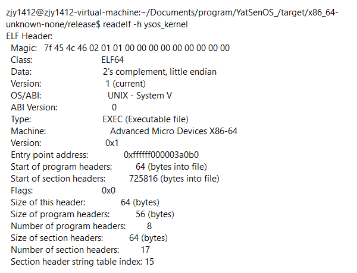
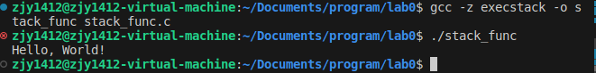

* content
{:toc}


# 实验要求

-   了解页表的作用、ELF 文件格式、操作系统在 x86 架构的基本启动过程。

-   尝试使用 UEFI 加载并跳转到内核执行内核代码。

-   实现基于 uart16550 的串口驱动，使用宏启用输出能力、并启用日志系统。

-   学习并尝试使用调试器对内核进行调试。

# 实验过程

## 编译内核 ELF

将0x01内的文件复制到自己的仓库中并替换重复文件，然后在 `pkg/kernel`
目录下运行 `cargo build --release`，编译内核。接着找到
`./target/release/x86_64-unknown-none/ysos_kernel` 。然后使用
`readelf -h` 指令查看编译产物的 `ELF` 文件头信息，如下：

{width="80%"}

-   请查看编译产物的架构相关信息，与配置文件中的描述是否一致？

架构：编译产物的架构是 "Advanced Micro Devices
X86-64"，与配置文件中指定的 "x86_64-unknown-none" 目标架构相符。

数据布局："2's complement, little endian" 对应于配置文件中的
"target-endian": "little"。这表示数据在内存中的存储方式是小端序。

指针宽度：编译产物的 Class 为 "ELF64"，这意味着它是一个 64
位的可执行文件，这与配置文件中的 "target-pointer-width": "64" 一致。

文件类型：编译产物的 Type 为 "EXEC (Executable file)"，这与配置文件中的
"executables": true 一致，说明生成的是可执行文件。

-   找出内核的入口点，它是被如何控制的？结合源码、链接、加载的过程，谈谈你的理解。

    在`kernel.ld`的链接脚本中，指定了内核的入口点为`_start`。这是一个约定的入口点符号，它是链接过程中确定的程序执行的起始位置。在
    Rust 中，通常 `_start` 会调用 `Rust runtime` 的初始化函数，然后进入
    main 函数。而在main函数中，`boot::entry_point!(kernel_main);` 使用
    boot crate 提供的宏声明内核的入口点为
    `kernel_main`。最后加载过程中，通过`kernel.ld`和`main.rs`的链接，将内核的入口点确定为`kernel_main`。

-   请找出编译产物的 segments 的数量，并且用表格的形式说明每一个
    segments 的权限、是否对齐等信息。

使用readelf -l指令查看编译产物的segments信息，如下：
{width="75%"}

绘制表格：

  --------- ---------------- -------------------- --------------- --------- ---------------
   Segment        Type             VirtAddr        Flags（权限）   FileSiz   Align（对齐）
      0           LOAD        0xffffff0000000000         R         0x3a000      0x1000
      1           LOAD        0xffffff000003a000       R, E        0x3b000      0x1000
      2           LOAD        0xffffff0000075000       R, W        0x7000       0x1000
      3           LOAD        0xffffff000007c000       R, W        0x4000       0x1000
      4         DYNAMIC       0xffffff000007b0c8       R, W         0x1f8         0x8
      5       `GNU_RELRO`     0xffffff000007b000         R         0x1000         0x1
      6      `GNU_EH_FRAME`   0xffffff00000395d8         R          0x34          0x4
      7       `GNU_STACK`            0x0               R, W          0x0         0x10
  --------- ---------------- -------------------- --------------- --------- ---------------

注：Flags中 R 表示可读，W 表示可写，E 表示可执行。

## 在 UEFI 中加载内核

### 加载相关文件

我首先在 `pkg/boot/src/main.rs` 中开始工作。为了加载配置文件和内核 ELF
文件，我调用了 `fs.rs`
中提供的`open_file`和`load_file`函数，读取了配置文件中的信息，包括内核栈大小和内核栈地址等。然后，根据配置文件中的信息，我加载了内核
ELF 文件到内存中。

### 更新控制寄存器

为了进行后续的内存映射操作，我使用了 Cr0::update
函数禁用了根页表的写保护，并在之后进行恢复。

### 映射内核文件

禁用根页表写保护后，我开始映射内核的代码段、数据段、BSS
段等到虚拟地址空间中。在完善了load*segment函数后（设置执行权限和写权限），我使用了
`pkg/elf/src/lib.rs` 中的 map_physical_memory，load*elf和map_range
函数来完成这个任务。

### 跳转执行

在将内核 ELF 文件加载并映射到适当的虚拟地址空间后，我需要退出 UEFI
的启动服务，并跳转到内核的入口点开始执行内核代码。这一部分代码由原代码提供，它调用了
exit_boot_services 函数退出启动服务，然后使用 jump_to_entry
函数跳转到内核的入口点。

### 调试内核

我先搭建了基于命令行的GDB和GEF调试环境。先使用'make build
DBG_INFO=true'编译内核，修改到无error后使用'make debug"
启动QEMU并进入调试模式，在另一个终端中使用'gdb
-q'进入GDB调试环境，打开对应的二进制文件并且设置远程连接后，在'ysos_kernel::init'处设置断点，接着使用'continue'命令运行内核，观察到断点被触发，说明调试环境搭建成功。不过由于此时还有UART的一些部分还未完成，所以在init这个断点处使用vmmap和readelf
-l进行检查时发现程序尝试访问无权限的内存。

-   `set_entry` 函数做了什么？为什么它是 unsafe 的？

答：`set_entry` 函数的功能应该是设置中断向量表的入口地址为 ELF
文件的入口地址。这个函数被标记为 unsafe
是因为它直接修改了处理器的状态，如果使用不当，可能会导致未定义行为。

-   `jump_to_entry` 函数做了什么？要传递给内核的参数位于哪里？查询 call
    指令的行为和 x86_64 架构的调用约定，借助调试器进行说明。

答：`jump_to_entry` 函数:

``` rust
pub unsafe fn jump_to_entry(bootinfo: *const BootInfo, stacktop: u64) -> ! {
    assert!(ENTRY != 0, "ENTRY is not set");
    asm!("mov rsp, {}; call {}", in(reg) stacktop, in(reg) ENTRY, in("rdi") bootinfo);
    unreachable!()
}
```

`jump_to_entry`函数的主要目的是将控制权从UEFI引导加载器转移到内核。它通过汇编指令将栈顶地址(`stacktop`)加载到`rsp`寄存器（即栈指针），然后调用`ENTRY`指向的函数。在这个过程中，它还将`bootinfo`的地址传递给该函数。

在这段代码中，`call`指令是用来调用一个函数的。在`x86_64`架构中，`call`指令会将返回地址（也就是`call`指令后面的指令的地址）压入栈中，然后跳转到目标地址执行代码。当目标函数执行完毕后，可以通过`ret`指令返回到`call`指令后面的指令。

正常来说如果要借助调试器进行说明的话，应该在call指令处设置断点，但是在`let (runtime, mmap) = system_table.exit_boot_services(MemoryType::LOADER_DATA);`之后的函数都无法再设置断点，因为这个函数会停止
UEFI 的引导服务，其中可能包括用于处理日志的服务。

-   `entry_point!` 宏做了什么？内核为什么需要使用它声明自己的入口点？

答：`entry_point!`
宏的功能应该是定义程序的入口点。内核需要使用它声明自己的入口点，因为当加载器加载内核并准备执行它时，需要知道从哪里开始执行。

-   如何为内核提供直接访问物理内存的能力？你知道几种方式？代码中所采用的是哪一种？

答：为内核提供直接访问物理内存的能力通常有以下几种方式：物理地址映射、页表、段式内存管理等。代码中采用的是物理地址映射，通过
`map_physical_memory` 函数将物理内存映射到虚拟地址空间。

-   为什么 ELF
    文件中不描述栈的相关内容？栈是如何被初始化的？它可以被任意放置吗？

答：ELF
文件是一种用于描述程序或库的格式，它不包含关于栈的信息是因为栈的管理通常由操作系统负责。在程序开始运行前，操作系统会为其分配和初始化一段栈空间。栈可以被放置在内存中的任意位置，只要这个位置是可用的，并且有足够的空间来容纳栈的最大可能大小。在代码中，栈的初始化是通过
`map_range` 函数实现的，它将一段内存区域映射为栈空间。

-   请解释指令 layout asm 的功能。倘若想找到当前运行内核所对应的 Rust
    源码，应该使用什么 GDB 指令？

答：`layout asm` 是 GDB
的一个命令，它会打开一个新的窗口来显示当前执行的汇编代码。这在理解程序的底层行为，特别是在调试底层系统代码时非常有用。在这个布局中可以看到程序计数器（PC）指向的当前执行的指令。
{width="80%"}
如果想要找到当前运行的内核对应的 Rust 源代码，可以使用 `layout src`
命令。这个命令会打开一个新窗口，显示当前执行的源代码。在这个布局中可以看到当前执行的源代码行。
{width="80%"} 另外，还可以使用 `list`
命令来查看源代码。`list` 命令会显示当前执行点附近的源代码。
{width="90%"}

-   假如在编译时没有启用 `DBG_INFO=true`，调试过程会有什么不同？

如果在编译时没有启用 `DBG_INFO=true`
或者没有使用类似的选项来生成调试信息，那么在调试过程中，你将无法访问到源代码级别的信息。这对于调试过程有以下几种影响：

1.  源代码查看：无法使用 GDB 的 `list` 或 `layout src`
    命令来查看源代码。这意味着无法直接在调试器中看到当前执行的源代码行。

2.  源代码级别的断点：无法在源代码级别设置断点。

3.  变量和函数名：无法使用变量名或函数名来查看或修改它们的值。例如不能使用
    `print variable_name` 这样的命令来打印一个变量的值。

4.  栈回溯：在执行 `backtrace`
    命令时无法看到函数名，只能看到它们的地址。

这些限制会使得调试过程变得更加困难，因为只可以使用汇编级别的调试功能，比如查看和修改寄存器的值，设置断点等。

-   你如何选择了你的调试环境？截图说明你在调试界面（TUI 或
    GUI）上可以获取到哪些信息？

源代码窗口：显示当前正在执行的源代码。当前行会被高亮显示。

汇编窗口：显示当前正在执行的汇编代码。

寄存器窗口：显示当前的寄存器状态。

`GDB` 控制台：显示 `GDB` 的输出，并允许你输入 `GDB` 命令。
{width="100%"}

## UART 与日志输出

### 串口驱动

#### 被保护的全局静态对象

在内核框架中提供了两个宏来引入互斥锁对内存进行保护。

``` rust
once_mutex!(pub SERIAL: SerialPort);
  guard_access_fn!(pub get_serial(SERIAL: SerialPort));
```

这样，即使有多个线程同时尝试访问
SerialPort，也只有一个线程可以在同一时间获得访问权。当 MutexGuard
离开作用域时，互斥锁会被自动释放，从而允许其他线程访问 SerialPort。

#### 串口驱动的设计

了解了COM1端口的基地址是0x3F8，同时熟悉了如何访问串口设备的寄存器。

#### 串口驱动的实现

参照了`Serial_Ports - OSDev Wiki`中的资料，同时使用了'PortWriteOnly" 和
`PortReadOnly`
来从类型系统上防止误操作的发生，实现了串口驱动的初始化、发送和接收功能。

#### 串口驱动的测试

成功看到 `[+] Serial Initialized.` 的输出，说明串口驱动已经成功初始化。
{width="80%"}

### 日志输出

依照要求完成了 `logger.rs`
的同时，我对log进行了一定的格式化，并且对不同level的log进行了不同的颜色标记。由于这是系统内核的设计，所以不能使用colored的依赖，好在能使用
`ANSI escape codes`
，所以分别给Error，Warn，Info，Debug和Trace赋予红黄绿青白五种颜色。

### Panic 处理

我将macros.rs中的'panic_handler'做了一些修改，使得输出变成如下形式。

``` rust
error!("ERROR: panic at '{}' at line {}, column {}:\n\n{:#?}\n\n{}", location.file(), location.line(), location.column(), info, message);
```

# 关键代码

## 在 UEFI 中加载内核

-   `pkg/boot/src/main.rs`：

``` rust
// 1. Load config
    let mut file = open_file(bs, CONFIG_PATH);
    let mut buf = load_file(bs, &mut file);

    let config = Config::parse(&buf);//FIXED

    info!("Config: {:#x?}", config);

    // 2. Load ELF files
    let mut file = open_file(bs, config.kernel_path);
    let mut buf = load_file(bs, &mut file);

    let elf = xmas_elf::ElfFile::new(&buf).expect("Failed to parse ELF file");//FIXED

    unsafe {
        set_entry(elf.header.pt2.entry_point() as usize);
    }

    // 3. Load MemoryMap
    let max_mmap_size = system_table.boot_services().memory_map_size();
    let mmap_storage = Box::leak(
        vec![0; max_mmap_size.map_size + 10 * max_mmap_size.entry_size].into_boxed_slice(),
    );
    let mmap = system_table
        .boot_services()
        .memory_map(mmap_storage)
        .expect("Failed to get memory map");

    let max_phys_addr = mmap
        .entries()
        .map(|m| m.phys_start + m.page_count * 0x1000)
        .max()
        .unwrap()
        .max(0x1_0000_0000); // include IOAPIC MMIO area

    // 4. Map ELF segments, kernel stack and physical memory to virtual memory
    let mut page_table = current_page_table();

    // FIXED: root page table is readonly, disable write protect (Cr0)
    unsafe {
        Cr0::update(|flags| {
            flags.remove(Cr0Flags::WRITE_PROTECT);
        });
    }
    
    // FIXED: map physical memory to specific virtual address offset
    let mut frame_allocator = UEFIFrameAllocator(bs);
    map_physical_memory(config.physical_memory_offset, max_phys_addr, &mut page_table, &mut frame_allocator);

    // FIXED: load and map the kernel elf file
    load_elf(&elf, config.physical_memory_offset, &mut page_table, &mut frame_allocator)
    .expect("Failed to load and map the kernel ELF file");

    // FIXED: map kernel stack
    map_range(config.kernel_stack_address, config.kernel_stack_size, &mut page_table, &mut frame_allocator)
    .expect("Failed to map kernel stack");

    // FIXED: recover write protect (Cr0)
    unsafe {
        Cr0::update(|flags| {
            flags.insert(Cr0Flags::WRITE_PROTECT);
        });
    }
    
    free_elf(bs, elf);
```

-   `pkg/elf/src/lib.rs`：

``` rust
// FIXED: handle page table flags with segment flags
    if segment.flags().is_write() {
        page_table_flags.insert(PageTableFlags::WRITABLE);
    }
    if !segment.flags().is_execute() {
        page_table_flags.insert(PageTableFlags::NO_EXECUTE);
    }

    // unimplemented!("Handle page table flags with segment flags!");

    trace!("Segment page table flag: {:?}", page_table_flags);
```

## UART 与日志输出

-   `uart16550.rs`：

``` rust
use core::fmt;
use x86_64::instructions::port::{Port, PortReadOnly, PortWriteOnly};
use bitflags::bitflags;

bitflags! {
    pub struct LineControlFlags: u8 {
        const DATA_5 = 0x00;
        const DATA_6 = 0x01;
        const DATA_7 = 0x02;
        const DATA_8 = 0x03;
        const STOP_1 = 0x00;
        const STOP_2 = 0x04;
        const PARITY_NONE = 0x00;
        const PARITY_ODD = 0x08;
        const PARITY_EVEN = 0x18;
        const PARITY_MARK = 0x28;
        const PARITY_SPACE = 0x38;
    }
}

/// A port-mapped UART 16550 serial interface.
pub struct SerialPort {
    base: u16,
    interrupt_enable: PortWriteOnly<u8>,
    line_status: PortReadOnly<u8>,
}

impl SerialPort {
    pub const fn new(base: u16) -> Self {
        Self {
            base,
            interrupt_enable: PortWriteOnly::new(base + 1),
            line_status: PortReadOnly::new(base + 5),
        }
    }

    /// Initializes the serial port.
    pub fn init(&mut self) {
        // FIXME: Initialize the serial port
        unsafe {
            self.interrupt_enable.write(0x00); // Disable all interrupts
            Port::<u8>::new(self.base + 3).write(0x80); // Enable DLAB (set baud rate divisor)
            Port::<u8>::new(self.base + 0).write(0x03); // Set divisor to 3 (lo byte) 38400 baud
            self.interrupt_enable.write(0x00); //                  (hi byte)
            Port::<u8>::new(self.base + 3).write(0x03); // 8 bits, no parity, one stop bit
            Port::<u8>::new(self.base + 2).write(0xC7); // Enable FIFO, clear them, with 14-byte threshold
            Port::<u8>::new(self.base + 4).write(0x0B); // IRQs enabled, RTS/DSR set
            Port::<u8>::new(self.base + 4).write(0x1E); // Set in loopback mode, test the serial chip
            Port::<u8>::new(self.base + 0).write(0xAE); // Test serial chip (send byte 0xAE and check if serial returns same byte)
            if Port::<u8>::new(self.base + 0).read() != 0xAE {
                panic!("Serial port failed to initialize");// If the serial port is not initialized, the system will panic.
            }
            Port::<u8>::new(self.base + 4).write(0x0F); // Re-enable normal operation
        }
        let line_control = LineControlFlags::DATA_8 | LineControlFlags::STOP_1 | LineControlFlags::PARITY_NONE;
        self.set_line_control(line_control);
    }

    /// Sends a byte on the serial port.
    pub fn send(&mut self, data: u8) {
        // FIXME: Send a byte on the serial port
        unsafe {
            while self.line_status.read() & 0x20 == 0 {
                // Wait for the serial port to be ready
            }
            Port::new(self.base).write(data);
        }
    }

    /// Receives a byte on the serial port no wait.
    pub fn receive(&mut self) -> Option<u8> {
        // FIXME: Receive a byte on the serial port no wait
        unsafe {
            while self.line_status.read() & 1 == 0 {
            }
            Some(Port::new(self.base).read())
        }
    }

            /// Sets the line control register.
    pub fn set_line_control(&mut self, flags: LineControlFlags) {
        unsafe {
            Port::new(self.base + 3).write(flags.bits());
        }
    }
}

impl fmt::Write for SerialPort {
    fn write_str(&mut self, s: &str) -> fmt::Result {
        for byte in s.bytes() {
            unsafe{
                self.send(byte);
            }
        }
        Ok(())
    }
}
```

-   `logger.rs`：

``` rust
use log::{Level, Metadata, Record};

pub fn init() {
    static LOGGER: Logger = Logger;
    log::set_logger(&LOGGER).unwrap();

    // FIXME: Configure the logger
    log::set_max_level(log::LevelFilter::Trace);

    info!("Logger Initialized.");
}

struct Logger;

impl log::Log for Logger {
    fn enabled(&self, _metadata: &Metadata) -> bool {
        true
    }

    fn log(&self, record: &Record) {
        if self.enabled(record.metadata()) {
            let color = match record.level() {
                Level::Error => "\x1B[31m", // red
                Level::Warn => "\x1B[33m", // yellow
                Level::Info => "\x1B[32m", // green
                Level::Debug => "\x1B[36m", // cyan
                Level::Trace => "\x1B[37m", // white
            };

            println!("{}{}: {}\x1B[0m", color, record.level(), record.args());
        }
    }

    fn flush(&self) {}
}
```

-   `macros.rs`：

``` rust
struct MessageWrapper<'a> {
    message: Option<&'a core::fmt::Arguments<'a>>,
}

impl<'a> core::fmt::Display for MessageWrapper<'a> {
    fn fmt(&self, f: &mut core::fmt::Formatter<'_>) -> core::fmt::Result {
        match &self.message {
            Some(args) => core::fmt::write(f, **args),
            None => f.write_str(""),
        }
    }
}

#[allow(dead_code)]
#[cfg_attr(not(test), panic_handler)]
fn panic(info: &core::panic::PanicInfo) -> ! {
    let location = info.location().unwrap(); // The panic location information is usually available, but it can be disabled by `panic_immediate_abort`.
    let message = MessageWrapper {
        message: info.message(),
    }; // The panic message is not always available.
    error!("ERROR: panic at '{}' at line {}, column {}:\n\n{:#?}\n\n{}", location.file(), location.line(), location.column(), info, message);
    loop {}
}
```

# 实验结果

全部工作完成后的结果： {width="100%"}
{width="100%"}

# 实验总结

# 思考题&加分项

1.  在 pkg/kernel 的 `Cargo.toml` 中，指定了依赖中 boot 包为
    default-features = false，这是为了避免什么问题？请结合 pkg/boot 的
    `Cargo.toml` 谈谈你的理解。

在 `Cargo.toml` 文件中，`default-features = false`
的设置是用来禁用依赖包的默认功能。这是因为在某些情况下，我们可能不希望启用所有的默认功能，而只是需要依赖包的一部分功能。

在 `pkg/boot` 的 `Cargo.toml` 文件中，定义了两个 feature：`boot` 和
`default`。`boot` feature 启用了 `uefi/alloc` 和 `uefi-services`
两个功能，而 `default` feature 则启用了 `boot`
feature。这意味着，如果没有特别指定，依赖这个包的其他包将默认启用
`uefi/alloc` 和 `uefi-services` 两个功能。

2.  在 `pkg/boot/src/main.rs` 中参考相关代码，聊聊 max_phys_addr
    是如何计算的，为什么要这么做？

`max_phys_addr` 是在代码中用来确定系统中最大的物理地址。它的计算是基于
UEFI
提供的内存映射信息，这些信息描述了系统中的所有物理内存区域，包括它们的起始地址、大小以及用途等信息。`max_phys_addr`
的计算过程如下：

``` rust
let max_phys_addr = mmap
    .entries()
    .map(|m| m.phys_start + m.page_count * 0x1000)
    .max()
    .unwrap()
    .max(0x1_0000_0000); // include IOAPIC MMIO area
```

在这段代码中，首先遍历了内存映射的所有条目。对于每一个条目，计算了它的结束地址（起始地址加上大小）。然后，从所有的结束地址中找出了最大的一个，这就是
`max_phys_addr`。

这么做的目的是为了确定系统中的全部物理内存范围，这对于后续的内存管理是非常重要的。例如，操作系统可能需要知道最大的物理地址，以便确定页表的大小，或者确定物理内存管理器的管理范围。

这里的 `max(0x1_0000_0000)` 是为了确保 `max_phys_addr` 至少是
`0x1_0000_0000`。这是因为在一些系统中，IOAPIC（输入/输出高级可编程中断控制器）的内存映射
I/O（MMIO）区域可能位于 `0x1_0000_0000`
地址，即使这个地址超过了实际的物理内存大小。为了能够正确地访问这个 MMIO
区域，需要确保 `max_phys_addr` 至少包括这个地址。

3.  串口驱动是在进入内核后启用的，那么在进入内核之前，显示的内容是如何输出的？

在系统启动并进入内核之前，显示的内容通常通过固件（UEFI）提供的服务来输出。在这个阶段，操作系统还没有加载完全，所以不能依赖于操作系统提供的设备驱动。

对于 UEFI 系统，它提供了一套 Boot
Services，这些服务包括一些基本的输入输出功能，例如读写文件，获取内存映射，以及在控制台上打印信息等。在代码中，这些服务被用来打印启动信息：

``` rust
info!("Running UEFI bootloader...");
```

`info!` 宏在这里是通过 UEFI 的 Boot Services 来打印信息的。这是通过配置
log crate 的方式实现的，log crate 是 Rust
的一个日志框架，它允许你设置一个全局的日志处理器来处理所有的日志消息。在
UEFI 环境下，你可以设置一个日志处理器，这个处理器使用 UEFI 的 Boot
Services 来打印日志消息。

4.  在 QEMU 中，我们通过指定 -nographic 参数来禁用图形界面，这样 QEMU
    会默认将串口输出重定向到主机的标准输出

-   假如我们将 Makefile 中取消该选项，QEMU
    的输出窗口会发生什么变化？请观察指令 make run QEMU_OUTPUT=
    的输出，结合截图分析对应现象。

如果取消了 -nographic 选项，QEMU
的输出窗口会变成图形界面。在这种情况下，QEMU
会显示一个图形窗口，用来模拟虚拟机的显示设备。这个窗口会显示虚拟机的输出，包括启动信息、内核输出等。
{width="100%"}

-   在移除 `-nographic`
    的情况下，如何依然将串口重定向到主机的标准输入输出？

在makefile的 `QEMU_ARGS` 的定义中添加 `-serial stdio` 参数后正常使用make
run即可。

5.  线控寄存器的每一比特都有特定的含义，尝试使用 bitflags
    宏来定义这些标志位，并在 uart16550 驱动中使用它们。

见代码 `uart16550.rs` 。

6.  尝试在进入内核并初始化串口驱动后，使用 escape sequence
    来清屏，并编辑 get_ascii_header() 中的字符串常量，输出你的学号信息。

使用`print!("\x1B[2J");`清屏，同时加了一行学号信息。
{width="100%"}

7.  尝试使用调试器，在内核初始化之后（`ysos::init`
    调用结束后）下断点，查看、记录并解释如下的信息：

-   内核的栈指针、栈帧指针、指令指针等寄存器的值。

-- 栈指针: `rsp` 的值为 `0x0`。

-- 栈帧指针: `rbp` 的值为 `0x0`。

-- 指令指针: `rip` 的值为 `0xfff0`。

这些值都是 `0x0` 或接近 `0x0`，这表明程序还在执行一些早期的初始化代码。

-   内核的代码段、数据段、BSS 段等在内存中的位置。

-- 代码段（`.text`）: 存放程序的机器代码。代码段的位置为
`0xffffff000003b000 - 0xffffff0000076225`。

-- 数据段（`.data`）: 存放初始化的全局和静态变量。数据段的位置为
`0xffffff0000077000 - 0xffffff000007cd40`。

-- BSS 段（`.bss`）: 存放未初始化的全局和静态变量。BSS 段的位置为
`0xffffff000007e000 - 0xffffff000007e028`。

这些值看起来都很合理，因为它们都在一个高地址范围内，这是典型的64位程序的特征。

8.  "开发者是愿意用安全换取灵活的"，所以，我要把代码加载到栈上去，可当我妄图在栈上执行代码的时候，却得到了
    Segment fault，你能解决这个问题吗？

现代操作系统通常使用一种叫做数据执行保护DEP）的技术，以防止恶意代码在程序的数据区域（如栈或堆）中执行。这是一种安全机制，可以防止许多常见的安全漏洞，如缓冲区溢出攻击。可以使用execstack工具来禁用这个安全机制，但是这是一个非常危险的操作。

-   请尝试利用 `gcc` 在 `Linux` 平台上编译一个简单的 `C`
    语言程序，将其编译为 `ELF` 格式的文件，并尝试在栈上执行它，使它输出
    `Hello, world!`。

``` c
#include <string.h>
#include <stdio.h>

void (*func)();

int main() {
    char code[] = {
        0x48, 0x31, 0xc0,             // xor    %rax,%rax
        0x48, 0xc7, 0xc7, 0x01, 0x00, // mov    \$0x1,%rdi
        0x00, 0x00,
        0x48, 0xc7, 0xc2, 0x12, 0x00, // mov    \$0xe,%rdx
        0x00, 0x00,
        0x48, 0x8d, 0x35, 0x0a, 0x00, // lea    0xa(%rip),%rsi
        0x00, 0x00,
        0xb8, 0x01, 0x00, 0x00, 0x00, // mov    \$0x1,%eax
        0x0f, 0x05,                   // syscall
        0xb8, 0x3c, 0x00, 0x00, 0x00, // mov    \$0x3c,%eax
        0x0f, 0x05,                   // syscall
        'H', 'e', 'l', 'l', 'o', ',', 
        ' ', 'W', 'o', 'r', 'l', 'd', 
        '!', '\n'
    };

    func = (void (*)()) code;
    func();

    return 0;
}
```

{width="100%"}
