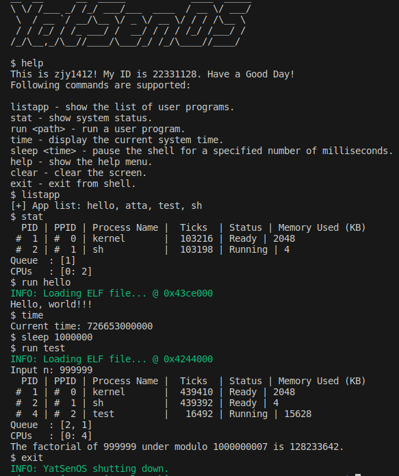
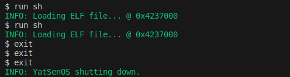
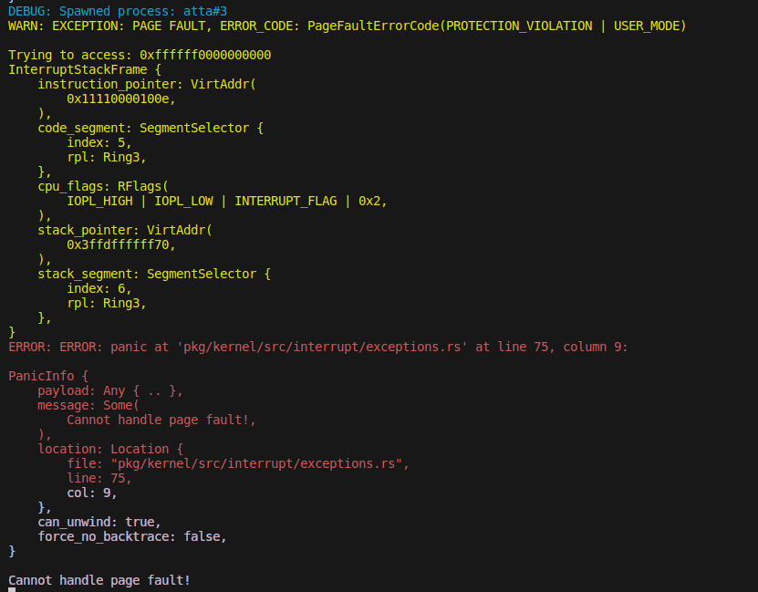
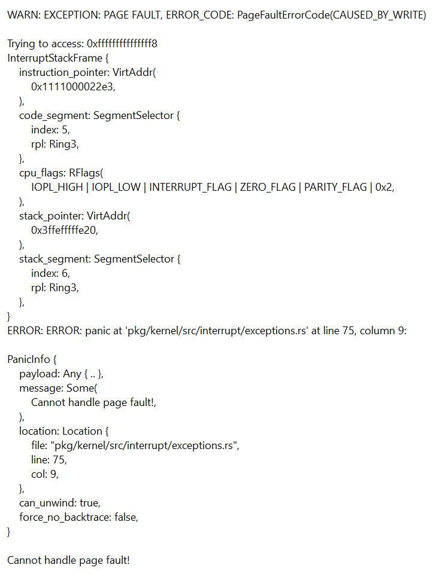
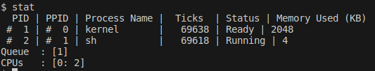
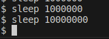

* content
{:toc}

# 实验要求

-   了解用户态与内核态的区别、用户程序的加载与执行。

-   补充页表、内存分配相关知识，了解使用链接器脚本编译能够被加载执行的程序。

-   实现基本的系统调用。

-   实现用户程序的加载与执行，并切换到用户态。

# 实验过程

## 用户程序

### 编译用户程序

在`Cargo.toml`中引用用户库（本次实验涉及3个app，都进行了引用，这是已经写好的Makefile强制要求的）。

``` toml
[dependencies]
lib = { path="../../lib", package="yslib"}
```

本次实验的最简单的一个app测试很自然的就是hello程序，这个hello程序使用
`entry!`
宏定义的入口函数（其中使用loop循环进行占位并卡住，这是后续实现的`sys_exit`函数的位置，但是不得不吐槽的是这个系统调用设计得有些复杂，在这里刚开始实验的时候一连回溯到底还是不明白是如何设计的）。

完成这一部分就可以成功编译出用户程序了，当然不能运行。

### 加载程序文件

（这里实验指导里写的"Makefile
需要根据此次实验进行更新"误导了我一会，我以为还需要对Makefile进行再修改，其实不需要）

这些用户程序的命名都是在`Cargo.toml`中指定的，如hello的`Cargo.toml`如下：

``` toml
[package]
name = "ysos_hello" #ysos_后面就是用户程序的名字
version = "0.1.0"
edition = "2021"

[dependencies]
lib = { path="../../lib", package="yslib"}
```

由于现在实验阶段的限制，我们只能在 `bootloader`
中将符合条件的用户程序加载到内存中，并将它们交给内核，用于生成用户进程。所以先实现`load_apps`函数，然后再在boot中进行调用从而完成用于程序的加载。

`load_apps`中我完成的部分其实就是从根找到`APP`文件夹，然后遍历其中的文件，将符合条件的文件加载到内存中，然后将其交给内核。

这些用户程序还要交给`ProcessManager`进行管理。

最后实现`list_app`函数，用于列出所有的用户程序，这个也将在后续shell的实现中作为一个其中的功能。

### 生成用户程序

添加 `spawn` 和 `elf_spawn`
函数（这里有因为Rust的`?`的语法困扰过，它会直接返回一个值）。这两个函数调用了要实现的`ProcessManager`的`spawn`方法，这里大体上是和上一个实验的`spawn_kernel_thread`是一致的，但是有一连串的东西需要添加与修改。

-   `load_elf`

这里在`ProcessInner`中封装了一个`load_elf`函数，其中复用了`elf::load_elf`，不过多加了一个`user_access`参数，在映射页面时，根据此参数决定是否添加
`USER_ACCESSIBLE` 标志位。

-   `alloc_init_stack_user`

这个方法其实也进行了类型的修改，但是这是后面的内容，为与内核栈（`alloc_init_stack`）进行区分，我另增一函数`alloc_init_stack_user`，用于为用户程序分配栈空间。

接着在 GDT 中为 Ring 3
的代码段和数据段添加对应的选择子，在初始化栈帧的时候将其传入。

## 系统调用的实现

### 调用约定

该实验定义了一个用于存储系统调用参数的结构体 SyscallArgs：

``` rust
#[derive(Clone, Debug)]
pub struct SyscallArgs {
    pub syscall: Syscall,
    pub arg0: usize,
    pub arg1: usize,
    pub arg2: usize,
}
```

在 pkg/syscall 中定义了一个 Syscall 枚举，用于存储系统调用号:

``` rust
#[repr(usize)]
#[derive(Clone, Debug, TryFromPrimitive)]
pub enum Syscall {
    Read = 0,
    Write = 1,

    Spawn = 59,
    Exit = 60,
    WaitPid = 61,

    ListApp = 65531,
    Stat = 65532,
    Allocate = 65533,
    Deallocate = 65534,

    #[num_enum(default)]
    Unknown = 65535,
}
```

### 软中断处理

为系统调用准备了一个独立的栈，然后和之前的中断处理一样，在 idt
的初始化中完成注册的工作。有一点不同的是要使用 `set_privilege_level`
设置 DPL 为 3，以便用户态程序可以触发系统调用。

最后务必要在IDT中填入注册函数！！！（我最后遇到的也是耗费时间最长的地方就是这里，由于没有填入注册函数，在运行用户程序时遇到GPF，我不断地进行调试，在这个过程中我修复了很多错误，包括但不限于上一个实验遗留的栈顶错误，还有在分配栈时用户权限设反了，甚至还有一个很难发现的bug，在进行栈扩展的时候没有设置用户权限等，所以到发现并修正了这一个小bug后，用户程序一跑就通。）

## 用户态库的实现

### 动态内存分配

在上文中已经提到了`alloc_init_stack_user`函数，用于为用户程序分配栈空间。其中使用并修改了原先的`elf::map_range`函数，用于指定合适的页面范围，分配并映射相关的页表（同样是增加
`user_access` 参数，用于判断是否增加 `USER_ACCESSIBLE` 标志位和
`NO_EXECUTE` 标志位）。

### 标准输入输出

这一部分主要是完成`sys_read`和`sys_write`。我按照我理解的内容，以`println！`为例将这个过程梳理一遍。

首先是下面这一串，最后落脚到`_print`中的`stdout.write`。

``` rust
#[doc(hidden)]
pub fn _print(args: Arguments) {
    stdout().write(format!("{}", args).as_str());
}
```

索引到Stdout，可以看到是使用`sys_write`。

``` rust
impl Stdout {
    fn new() -> Self {
        Self
    }

    pub fn write(&self, s: &str) {
        sys_write(1, s.as_bytes());
    }
}
```

这个`sys_write`在`syscall.rs`中，我们可以发现使用了`syscall!(Syscall::Write,...)`。

``` rust
#[inline(always)]
pub fn sys_write(fd: u8, buf: &[u8]) -> Option<usize> {
    let ret = syscall!(
        Syscall::Write,
        fd as u64,
        buf.as_ptr() as u64,
        buf.len() as u64
    ) as isize;
    if ret.is_negative() {
        None
    } else {
        Some(ret as usize)
    }
}
```

上面的`Syscall::Write`是在下面这个枚举类型中定义的。

``` rust
pub enum Syscall {
    Read = 0,
    Write = 1,

    ...
}
```

它会跳到分发器函数 `dispatcher`
中，然后根据不同的系统调用号调用不同的处理函数，这里就是`sys_write`。

``` rust
pub fn dispatcher(context: &mut ProcessContext) {
    let args = super::syscall::SyscallArgs::new(
        Syscall::from(context.regs.rax),
        context.regs.rdi,
        context.regs.rsi,
        context.regs.rdx,
    );

    match args.syscall {
        ...
        // fd: arg0 as u8, buf: &[u8] (ptr: arg1 as *const u8, len: arg2)
        Syscall::Write => { 
            /* FIXME: write to fd & return length */
            context.set_rax(sys_write(&args));
        },
        ...
    }
}
```

这个自然是`service.rs`中的`sys_write`。

``` rust
pub fn sys_write(args: &SyscallArgs) -> usize {
    let fd = args.arg0 as u8;
    let buf = unsafe {
        core::slice::from_raw_parts(args.arg1 as *const u8, args.arg2)
    };

    proc::write(fd, buf) as usize
}
```

然后就是一连串的调用了。

``` rust
pub fn write(fd: u8, buf: &[u8]) -> isize {
    x86_64::instructions::interrupts::without_interrupts(|| get_process_manager().write(fd, buf))
}
```

``` rust
pub fn write(&self, fd: u8, buf: &[u8]) -> isize {
        let current_process = self.current();
        let inner = current_process.write();
        inner.write(fd, buf)
    }
```

``` rust
pub fn write(&self, fd: u8, buf: &[u8]) -> isize{
        self.proc_data.as_ref().unwrap().write(fd, buf)
    }
```

``` rust
pub fn write(&self, fd: u8, buf: &[u8]) -> isize {
        self.resources.read().write(fd, buf)
    }
```

``` rust
pub fn write(&self, fd: u8, buf: &[u8]) -> isize {
        if let Some(count) = self.handles.get(&fd).and_then(|h| h.lock().write(buf)) {
            count as isize
        } else {
            -1
        }
    }
```

几经辗转来到`Resource`的`write`方法。

``` rust
pub fn write(&mut self, buf: &[u8]) -> Option<usize> {
        match self {
            Resource::Console(stdio) => match *stdio {
                StdIO::Stdin => None,
                StdIO::Stdout => {
                    print!("{}", String::from_utf8_lossy(buf));
                    Some(buf.len())
                }
                StdIO::Stderr => {
                    warn!("{}", String::from_utf8_lossy(buf));
                    Some(buf.len())
                }
            },
            Resource::Null => Some(buf.len()),
        }
    }
```

这一部分的内容串起来有点过于长了，我不知道是不是必要的，总感觉可以短一点的。另外read和write的实现就略过去了。（read的一些代码与前面的实现有些关系，）

### 进程的退出

exit的实现依次使用`kill`和`switch_next`方法即可。（这两个都在上一次实验完成了）

做到这里是可以运行用户程序的了，但是由于我此时代码存在仍在GPF中，所以就把后续实验一并做了。

### 进程的创建与等待

依次完成`spawn`，`waitpid`和`getpid`，这一部分其实在上次实验和前面完成的部分有所铺垫，不再赘述。

## 运行 Shell

其实除了上面的内容，还有很多琐碎的事情要完成。在处理完之后，终于可以开始shell的构建了。其实就是对先前实现的功能的一个总和，这里我只放一个我help指令的输出。

``` shell
$ help
This is zjy1412! My ID is 22331128. Have a Good Day!
Following commands are supported:

listapp - show the list of user programs.
stat - show system status.
spawn <path> - run a user program.
help - show the help menu.
clear - clear the screen.
exit - exit from shell.
```

### 测试程序

斐波那契的测试程序见实验结果。

# 关键代码

`pkg/kernel/src/lib.rs`

``` rust
pub fn init(boot_info: &'static BootInfo) {
    serial::init(); // init serial output
    logger::init(); // init logger system
    memory::address::init(boot_info);
    memory::allocator::init(); // init kernel heap allocator
    memory::gdt::init(); // init gdt
    interrupt::init(); // init interrupts
    memory::init(boot_info); // init memory manager
    memory::user::init();
    proc::init(boot_info); // init process manager
    clock::init(boot_info); // init clock
    x86_64::instructions::interrupts::enable();
    info!("Interrupts Enabled.");

    info!("YatSenOS initialized.");
}

pub fn wait(init: proc::ProcessId) {
    loop {
        if proc::still_alive(init) {
            // Why? Check reflection question 5
            x86_64::instructions::hlt();
        } else {
            break;
        }
    }
}
```

`pkg/boot/src/lib.rs`

``` rust
const MAX_APP_COUNT: usize = 16;

/// App information
pub struct App {
    /// The name of app
    pub name: ArrayString<16>,
    /// The ELF file
    pub elf: ElfFile<'static>,
}

pub type AppList = ArrayVec<App, MAX_APP_COUNT>;
pub type AppListRef<'a> = Option<&'static AppList>;
// pub type AppListRef<'a> = ArrayVec<&'static App<'a>, MAX_APP_COUNT>;

/// This structure represents the information that the bootloader passes to the kernel.
pub struct BootInfo {
    /// The memory map
    pub memory_map: MemoryMap,

    /// The offset into the virtual address space where the physical memory is mapped.
    pub physical_memory_offset: u64,

    /// UEFI SystemTable
    pub system_table: SystemTable<Runtime>,

    // Loaded apps
    pub loaded_apps: Option<AppList>,
}
```

`pkg/boot/src/fs.rs`

``` rust
pub fn load_apps(bs: &BootServices) -> AppList {
    let mut root = open_root(bs);
    let mut buf = [0; 8];
    let cstr_path = uefi::CStr16::from_str_with_buf("\\APP\\", &mut buf).unwrap();

    let file_handle = root
    .open(cstr_path, FileMode::Read, FileAttribute::DIRECTORY)
    .expect("Failed to open APP directory");

    let mut handle = match file_handle.into_type().expect("Failed to get directory type") {
        FileType::Dir(directory) => directory,
        _ => panic!("Handle is not a directory"),
    };

    let mut apps = ArrayVec::new();
    let mut entry_buf = [0u8; 0x100];

    loop {
        let info = handle
            .read_entry(&mut entry_buf)
            .expect("Failed to read entry");

        match info {
            Some(entry) => {
                let file_name = entry.file_name();
                info!("Try to open file: {:?}", file_name);

                let file = handle
                .open(entry.file_name(), FileMode::Read, FileAttribute::empty())
                .expect("Failed to open app binary file");/* get hand,le for app binary file */ 

                if file.is_directory().unwrap_or(true) {
                    continue;
                }

                let mut file = match file.into_type().expect("Failed to into_type") {
                    FileType::Regular(regular) => regular,
                    _ => panic!("Invalid file type"),
                };

                    // load file with `load_file` function
                    // convert file to `ElfFile`
                let elf_buf = load_file(bs, &mut file);
                let elf = ElfFile::new(elf_buf).expect("Failed to parse ELF file");

                let mut name = ArrayString::<16>::new();
                entry.file_name().as_str_in_buf(&mut name).unwrap();

                apps.push(App { name, elf });
            }
            None => break,
        }
    }

    info!("Loaded {} apps", apps.len());

    apps
}
```

`pkg/boot/src/main.rs`

``` rust
// ...

let apps = if config.load_apps {
    info!("Loading apps...");
    Some(load_apps(system_table.boot_services()))
} else {
    info!("Skip loading apps");
    None
};

// ...

// load and map the kernel elf file
load_elf(&elf, config.physical_memory_offset, &mut page_table, &mut frame_allocator, false)
.expect("Failed to load and map the kernel ELF file");


// map kernel stack
map_range(config.kernel_stack_address, config.kernel_stack_size, &mut page_table, &mut frame_allocator, false)
.expect("Failed to map kernel stack");

// ...

// construct BootInfo
let bootinfo = BootInfo {
    // ...
    loaded_apps: apps,
};
```

`pkg/kernel/src/proc/mod.rs`

``` rust
/// init process manager
pub fn init(boot_info: &'static boot::BootInfo) {
    let mut kproc_data = ProcessData::new();

    //  set the kernel stack
    kproc_data.set_stack(VirtAddr::new(KSTACK_INIT_BOT), KSTACK_DEF_SIZE);

    trace!("Init process data: {:#?}", kproc_data);

    // kernel process
    let kproc = Process::new(
        /* process name */ "kernel".into(), 
        /* parent process */ None, 
        /* page table */ PageTableContext::new(), 
        /* process data */ Some(kproc_data),
    );//{ /*create kernel process */ };

    let app_list = boot_info.loaded_apps.as_ref();
    manager::init(kproc, app_list);

    info!("Process Manager Initialized.");
}

pub fn list_app() {
    x86_64::instructions::interrupts::without_interrupts(|| {
        let app_list = get_process_manager().app_list();
        if app_list.is_none() {
            println!("[!] No app found in list!");
            return;
        }

        let apps = app_list
            .unwrap()
            .iter()
            .map(|app| app.name.as_str())
            .collect::<Vec<&str>>()
            .join(", ");

        // TODO: print more information like size, entry point, etc.

        println!("[+] App list: {}", apps);
    });
}

pub fn spawn(name: &str) -> Option<ProcessId> {
    let app = x86_64::instructions::interrupts::without_interrupts(|| {
        let app_list = get_process_manager().app_list()?;
        app_list.iter().find(|&app| app.name.eq(name))
    })?;

    elf_spawn(name.to_string(), &app.elf)
}

pub fn elf_spawn(name: String, elf: &ElfFile) -> Option<ProcessId> {
    let pid = x86_64::instructions::interrupts::without_interrupts(|| {
        let manager = get_process_manager();
        let process_name = name.to_lowercase();
        let parent = Arc::downgrade(&manager.current());
        let pid = manager.spawn(elf, name, Some(parent), None);

        debug!("Spawned process: {}#{}", process_name, pid);
        pid
    });
    Some(pid)
}

pub fn read(fd: u8, buf: &mut [u8]) -> isize {
    x86_64::instructions::interrupts::without_interrupts(|| get_process_manager().read(fd, buf))
}

pub fn write(fd: u8, buf: &[u8]) -> isize {
    x86_64::instructions::interrupts::without_interrupts(|| get_process_manager().write(fd, buf))
}

pub fn exit(ret: isize, context: &mut ProcessContext) {
    x86_64::instructions::interrupts::without_interrupts(|| {
        let manager = get_process_manager();
        // FIXME: implement this for ProcessManager
        manager.kill_current(ret);
        manager.switch_next(context);
    })
}

#[inline]
pub fn still_alive(pid: ProcessId) -> bool {
    x86_64::instructions::interrupts::without_interrupts(|| {
        // check if the process is still alive
        // get_process_manager().get_proc(&pid).unwrap().read().status() != ProgramStatus::Dead
        get_process_manager().is_alive(pid)
    })
}
```

`pkg/kernel/src/proc/manager.rs`

``` rust
pub struct ProcessManager {
    ...
    app_list: boot::AppListRef<'static>,
}

impl ProcessManager {
    pub fn new(init: Arc<Process>, app_list: boot::AppListRef) -> Self {
        ...
        Self {
            ...
            app_list: app_list,
        }
    }

    pub fn check_proc(&self, pid: &ProcessId) -> Option<isize> {
        self.get_proc(pid).unwrap().read().exit_code()
    }

    pub fn is_alive(&self, pid: ProcessId) -> bool {
        self.get_proc(&pid)
            .map(|p| p.read().is_alive())
            .unwrap_or(false)
        // self.get_proc(&pid).unwrap().read().status() != ProgramStatus::Dead
    }

    pub fn app_list(&self) -> boot::AppListRef<'static> {
        self.app_list
    }


    pub fn read(&self, fd: u8, buf: &mut [u8]) -> isize {
        let current_process = self.current();
        let inner = current_process.write();
        inner.read(fd, buf)
    }

    pub fn write(&self, fd: u8, buf: &[u8]) -> isize {
        let current_process = self.current();
        let inner = current_process.write();
        inner.write(fd, buf)
    }

    pub fn spawn(
        &self,
        elf: &ElfFile,
        name: String,
        parent: Option<Weak<Process>>,
        proc_data: Option<ProcessData>,
    ) -> ProcessId {
        let kproc = self.get_proc(&KERNEL_PID).unwrap();
        let page_table = kproc.read().clone_page_table();
        let proc = Process::new(name, parent, page_table, proc_data);
        let pid = proc.pid();
    
        let mut inner = proc.write();
        //load elf to process pagetable
        inner.load_elf(elf);
        drop(inner);
        let stack_top = proc.alloc_init_stack_user();
        {
            // FIXME: alloc new stack for process
            let mut inner = proc.write();
            inner.set_proc_data_stack(stack_top - STACK_DEF_SIZE + 8, STACK_DEF_SIZE);
            inner.init_context(VirtAddr::new(elf.header.pt2.entry_point()), stack_top);
        }
        // mark process as ready
        // let mut inner = proc.write();
        // inner.pause();

        // drop(inner);
    
        trace!("New {:#?}", &proc);

        self.add_proc(pid, proc);
        self.push_ready(pid);
    
        pid
    }

    pub fn kill_current(&self, ret: isize) {
        self.kill(processor::get_pid(), ret);
    }

    pub fn kill(&self, pid: ProcessId, ret: isize) {
        let proc = self.get_proc(&pid);

        if proc.is_none() {
            warn!("Process #{} not found.", pid);
            return;
        }

        let proc = proc.unwrap();

        if proc.read().status() == ProgramStatus::Dead {
            warn!("Process #{} is already dead.", pid);
            return;
        }

        trace!("Kill {:#?}", &proc);

        proc.kill(ret);
    }

    pub fn print_process_list(&self) {
        let mut output = String::from("  PID | PPID | Process Name |  Ticks  | Status | Memory Used (KB)\n");
    
        self.processes
            .read()
            .values()
            .filter(|p| p.read().status() != ProgramStatus::Dead)
            .for_each(|p| { 
                let memory_used = p.read().memory_used();
                output += format!("{} | {}\n", p, memory_used).as_str(); 
            });
    
        // TODO: print memory usage of kernel heap
    
        output += format!("Queue  : {:?}\n", self.ready_queue.lock()).as_str();
    
        output += &processor::print_processors();
    
        print!("{}", output);
    }
}
```

`pkg/elf/src/lib.rs`

``` rust
/// Map a range of memory
///
/// allocate frames and map to specified address (R/W)
pub fn map_range(
    ...,
    user_access: bool,
) -> Result<PageRange, MapToError<Size4KiB>> {
    ...

    // default flags for stack
    let mut flags = PageTableFlags::PRESENT | PageTableFlags::WRITABLE;
    if user_access {
        flags |= PageTableFlags::USER_ACCESSIBLE | PageTableFlags::NO_EXECUTE;
    }

    ...
}

pub fn unmap_range(
    start_addr: VirtAddr,
    end_addr: VirtAddr,
    page_table: &mut impl Mapper<Size4KiB>,
    frame_deallocator: &mut impl FrameDeallocator<Size4KiB>,
) {
    let start_page = Page::containing_address(start_addr);
    let end_page = Page::containing_address(end_addr);
    for page in Page::range(start_page, end_page) {
        let (frame, _flags) = page_table.unmap(page).expect("Unmap failed");
        trace!("Unmapped virtual page {:?}, deallocating frame {:?}", page, frame);
        unsafe {
            frame_deallocator.deallocate_frame(frame);
        }
    }
}

/// Load & Map ELF file
///
/// load segments in ELF file to new frames and set page table
pub fn load_elf(
    ...,
    user_access: bool,
) -> Result<(), MapToError<Size4KiB>> {
    let file_buf = elf.input.as_ptr();

    info!("Loading ELF file... @ {:#x}", file_buf as u64);

    for segment in elf.program_iter() {
        if segment.get_type().unwrap() != program::Type::Load {
            continue;
        }

        load_segment(
            file_buf,
            physical_offset,
            &segment,
            page_table,
            frame_allocator,
            user_access,
        )?
    }

    Ok(())
}

/// Load & Map ELF segment
///
/// load segment to new frame and set page table
fn load_segment(
    ...,
    user_access: bool,
) -> Result<(), MapToError<Size4KiB>> {
    ...

    if user_access {
        page_table_flags.insert(PageTableFlags::USER_ACCESSIBLE);
    }

    ...
}
```

`pkg/kernel/src/memory/gdt.rs`

``` rust
pub const SYS_CALL_IST_INDEX: u16 = 3;

pub const IST_SIZES: [usize; 5] = [0x1000, 0x1000, 0x1000, 0x1000, 0x1000];

lazy_static! {
    static ref TSS: TaskStateSegment = {
        let mut tss = TaskStateSegment::new();

        ...

        tss.interrupt_stack_table[SYS_CALL_IST_INDEX as usize] = {
            const STACK_SIZE: usize = IST_SIZES[4];
            static mut STACK: [u8; STACK_SIZE] = [0; STACK_SIZE];
            let stack_start = VirtAddr::from_ptr(unsafe { STACK.as_ptr() });
            let stack_end = stack_start + STACK_SIZE as u64;
            info!(
                "Sys Call Stack: 0x{:016x}-0x{:016x}",
                stack_start.as_u64(),
                stack_end.as_u64()
            );
            stack_end
        };

        tss
    };
}

lazy_static! {
    static ref GDT: (GlobalDescriptorTable, Selectors) = {
        let mut gdt = GlobalDescriptorTable::new();
        let code_selector = gdt.append(Descriptor::kernel_code_segment());
        let data_selector = gdt.append(Descriptor::kernel_data_segment());
        let tss_selector = gdt.append(Descriptor::tss_segment(&TSS));
        let user_code_selector = gdt.append(Descriptor::user_code_segment());
        let user_data_selector = gdt.append(Descriptor::user_data_segment());

        (
            gdt,
            Selectors {
                kernel_selectors: KernelSelectors {
                    code_selector,
                    data_selector,
                    tss_selector,
                },
                user_selectors: UserSelectors {
                    user_code_selector,
                    user_data_selector,
                },
            },
        )
    };
}

#[derive(Debug)]
pub struct KernelSelectors {
    pub code_selector: SegmentSelector,
    pub data_selector: SegmentSelector,
    tss_selector: SegmentSelector,
}

#[derive(Debug)]
pub struct UserSelectors {
    pub user_code_selector: SegmentSelector,
    pub user_data_selector: SegmentSelector,
}

#[derive(Debug)]
pub struct Selectors {
    pub kernel_selectors: KernelSelectors,
    pub user_selectors: UserSelectors,
}

...

pub fn get_selector() -> &'static KernelSelectors {
    &GDT.1.kernel_selectors
}

pub fn get_user_selector() -> &'static UserSelectors {
    &GDT.1.user_selectors
}
```

`pkg/kernel/src/proc/context.rs`

``` rust
impl ProcessContext {
    pub fn init_stack_frame(&mut self, entry: VirtAddr, stack_top: VirtAddr) {
        self.value.stack_frame.stack_pointer = stack_top;
        self.value.stack_frame.instruction_pointer = entry;
        self.value.stack_frame.cpu_flags =
            RFlags::IOPL_HIGH | RFlags::IOPL_LOW | RFlags::INTERRUPT_FLAG;

        let selector = get_user_selector();

        self.value.stack_frame.code_segment = selector.user_code_selector;
        self.value.stack_frame.stack_segment = selector.user_data_selector;

        trace!("Init stack frame: {:#?}", &self.stack_frame);
    }
}
```

`pkg/kernel/src/interrupt/syscall/mod.rs`

``` rust
// write syscall service handler in `service.rs`
use service::*;

pub unsafe fn register_idt(idt: &mut InterruptDescriptorTable) {
    // register syscall handler to IDT
    //        - standalone syscall stack
    //        - ring 3
    idt[consts::Interrupts::Syscall as u8]
    .set_handler_fn(syscall_handler)
    .set_stack_index(SYS_CALL_IST_INDEX)
    .set_privilege_level(x86_64::PrivilegeLevel::Ring3);
}

pub extern "C" fn syscall(mut context: ProcessContext) {
    x86_64::instructions::interrupts::without_interrupts(|| {
        super::syscall::dispatcher(&mut context);
    });
}

as_handler!(syscall);

#[derive(Clone, Debug)]
pub struct SyscallArgs {
    pub syscall: Syscall,
    pub arg0: usize,
    pub arg1: usize,
    pub arg2: usize,
}

pub fn dispatcher(context: &mut ProcessContext) {
    let args = super::syscall::SyscallArgs::new(
        Syscall::from(context.regs.rax),
        context.regs.rdi,
        context.regs.rsi,
        context.regs.rdx,
    );

    // NOTE: you may want to trace syscall arguments
    // trace!("{}", args);

    match args.syscall {
        // fd: arg0 as u8, buf: &[u8] (ptr: arg1 as *const u8, len: arg2)
        Syscall::Read => { 
            /* read from fd & return length */
            context.set_rax(sys_read(&args));
        },
        // fd: arg0 as u8, buf: &[u8] (ptr: arg1 as *const u8, len: arg2)
        Syscall::Write => { 
            /* write to fd & return length */
            context.set_rax(sys_write(&args));
        },

        // None -> pid: u16
        Syscall::GetPid => { 
            /* get current pid */
            context.set_rax(get_pid());
        },

        // path: &str (ptr: arg0 as *const u8, len: arg1) -> pid: u16
        Syscall::Spawn => { 
            /* spawn process from name */
            context.set_rax(spawn_process(&args));
        },
        // ret: arg0 as isize
        Syscall::Exit => { 
            /* exit process with retcode */
            exit_process(&args, context);
        },
        // pid: arg0 as u16 -> status: isize
        Syscall::WaitPid => { 
            /* check if the process is running or get retcode */
            context.set_rax(sys_wait_pid(&args) as usize);
        },

        // None
        Syscall::Stat => { 
            /* list processes */ 
            list_process();
        },

        Syscall::Time => {
            context.set_rax(sys_time());
        }

        // None
        Syscall::ListApp => { 
            /* list available apps */
            sys_list_app();
        },

        // ----------------------------------------------------
        // NOTE: following syscall examples are implemented
        // ----------------------------------------------------

        // layout: arg0 as *const Layout -> ptr: *mut u8
        Syscall::Allocate => context.set_rax(sys_allocate(&args)),
        // ptr: arg0 as *mut u8
        Syscall::Deallocate => sys_deallocate(&args),
        // Unknown
        Syscall::Unknown => warn!("Unhandled syscall: {:x?}", context.regs.rax),
    }
}
```

`pkg/kernel/src/interrupt/syscall/service.rs`

``` rust
pub fn spawn_process(args: &SyscallArgs) -> usize {
    // get app name by args
    //       - core::str::from_utf8_unchecked
    //       - core::slice::from_raw_parts
    let name = args.arg0 as *const u8;
    let len = args.arg1;
    let name_slice = unsafe{core::slice::from_raw_parts(name, len)};
    let app_name = unsafe{core::str::from_utf8_unchecked(name_slice)};
    // spawn the process by name
    let ret = proc::spawn(app_name);
    // handle spawn error, return 0 if failed
    // return pid as usize
    match ret{
        Some(pid) => {
            pid.0 as usize
        }
        None => {
            0
        }
    }
}

pub fn sys_write(args: &SyscallArgs) -> usize {
    // get buffer and fd by args
    //       - core::slice::from_raw_parts
    // call proc::write -> isize
    // return the result as usize
    let fd = args.arg0 as u8;
    let buf = unsafe {
        core::slice::from_raw_parts(args.arg1 as *const u8, args.arg2)
    };

    proc::write(fd, buf) as usize
}

pub fn sys_read(args: &SyscallArgs) -> usize {
    // just like sys_write

    let fd = args.arg0 as u8;
    let buf = unsafe {
        core::slice::from_raw_parts_mut(args.arg1 as *mut u8, args.arg2)
    };

    proc::read(fd, buf) as usize
}

pub fn exit_process(args: &SyscallArgs, context: &mut ProcessContext) {
    // exit process with retcode
    let ret = args.arg0 as isize;

    exit(ret, context);
}

pub fn list_process() {
    // list all processes
    let manager = get_process_manager();
    manager.print_process_list();
}

pub fn sys_list_app() {
    // list all apps
    proc::list_app();
}

...

pub fn get_pid() -> usize {
    let manager = get_process_manager();
    manager.current().pid().0 as usize
}

pub fn sys_wait_pid(args: &SyscallArgs) -> isize {
    let pid = args.arg0;
    let manager = get_process_manager();
    if let Some(ret) = manager.check_proc(&ProcessId(pid as u16)) {
        ret
    }
    else {
        -1
    }
}

pub fn sys_time() -> usize {
    let time = get_uefi_runtime();
    time_to_micros(time.get_time()) as usize
}
```

pkg/kernel/src/memory/user.rs

``` rust
pub fn init() {
    init_user_heap().expect("User Heap Initialization Failed.");
    info!("User Heap Initialized.");
}

pub fn init_user_heap() -> Result<(), MapToError<Size4KiB>> {
    // Get current pagetable mapper
    let mapper = &mut PageTableContext::new().mapper();
    // Get global frame allocator
    let frame_allocator = &mut *super::get_frame_alloc_for_sure();

    //  use elf::map_range to allocate & map
    //        frames (R/W/User Access)

    map_range(
        USER_HEAP_START as u64,
        USER_HEAP_PAGE as u64,
        mapper,
        frame_allocator,
        true,
    )?;

    unsafe {
        USER_ALLOCATOR
            .lock()
            .init(USER_HEAP_START as *mut u8, USER_HEAP_SIZE);
    }

    Ok(())
}
```

`pkg/kernel/src/proc/data.rs`

``` rust
pub struct ProcessData {
    // shared data
    pub(super) env: Arc<RwLock<BTreeMap<String, String>>>,

    // process specific data
    pub(super) stack_segment: Option<PageRange>,
    pub(super) code_segment: Option<PageRange>,

    pub(super) resources: Arc<RwLock<ResourceSet>>,
}

impl Default for ProcessData {
    fn default() -> Self {
        Self {
            env: Arc::new(RwLock::new(BTreeMap::new())),
            stack_segment: None,
            code_segment: None,
            resources: Arc::new(RwLock::new(ResourceSet::default()))
        }
    }
}

impl ProcessData {
    pub fn new() -> Self {
        Self::default()
    }

    pub fn read(&self, fd: u8, buf: &mut [u8]) -> isize {
        self.resources.read().read(fd, buf)
    }
    
    pub fn write(&self, fd: u8, buf: &[u8]) -> isize {
        self.resources.read().write(fd, buf)
    }

    ...

    pub fn set_stack(&mut self, start: VirtAddr, size: u64) {
        let start_page = Page::containing_address(start);
        let pages = size / PAGE_SIZE;
        let end_page = Page::containing_address(start + pages * PAGE_SIZE);
        self.stack_segment = Some(Page::range(start_page, end_page));
    }

    pub fn set_code(&mut self, start: VirtAddr, size: u64) {
        let start = Page::containing_address(start);
        self.code_segment = Some(Page::range(start, start + size));
    }

    pub fn pages_used(&self) -> usize {
        let stack_pages = self.stack_segment.map_or(0, |r| r.count());
        let code_pages = self.code_segment.map_or(0, |r| r.count());
        stack_pages + code_pages
    }

    pub fn memory_used(&self) -> usize {
        self.pages_used() * 4
    }

    pub fn is_on_stack(&self, addr: VirtAddr) -> bool {
        // check if the address is on the stack
        if let Some(stack_segment) = self.stack_segment {
            let start = stack_segment.start.start_address();
            let end = stack_segment.end.start_address();
            addr >= start && addr < end
        } else {
            false
        }
        // true
    }
}
```

`pkg/app/sh/src/main.rs`

``` rust
#![no_std]
#![no_main]

use lib::*;
use crate::string::String;
use crate::vec::Vec;

extern crate lib;

#[inline(always)]
fn clear_screen() {
    print!("\x1B[2J\x1B[H");
}

pub fn sleep(millisecs: usize) {
    let start = sys_time();
    let mut current = start;
    while current - start < millisecs {
        current = sys_time();
    }
}

fn main() -> isize {
    loop {
        let mut input = String::new();
        print!("$ ");

        input = lib::stdin().read_line();

        let commands: Vec<&str> = input.trim().split_whitespace().collect();
        match commands[0] {
            "listapp" => sys_list_app(),
            "stat" => sys_stat(),
            "clear" => clear_screen(),
            "run" => {
                if commands.len() < 2 {
                    println!("Please specify the path to spawn.");
                } else {
                    let pid = sys_spawn(commands[1]);
                    if pid == 0 {
                        println!("The specified app does not exist.");
                    } else {
                        sys_wait_pid(pid);
                    }
                }
            },
            "help" => {
                println!("This is zjy1412! My ID is 22331128. Have a Good Day!");
                println!("Following commands are supported:\n");
                println!("listapp - show the list of user programs.");
                println!("stat - show system status.");
                println!("run <path> - run a user program.");
                println!("time - display the current system time.");
                println!("sleep <time> - pause the shell for a specified number of milliseconds.");
                println!("help - show the help menu.");
                println!("clear - clear the screen.");
                println!("exit - exit from shell.");
            },
            "exit" => {
                sys_exit(0);
            },
            "time" => {
                let time = sys_time();
                println!("Current time: {}", time);
            },
            "sleep" => {
                if commands.len() < 2 {
                    println!("Please specify the time to sleep.");
                } else {
                    let time = commands[1].parse::<usize>().unwrap();
                    sleep(time);
                }
            }
            _ => {
                println!("Unknown command");
            },
        }
    }

    0
}

entry!(main);
```

`pkg/app/atta/src/main.rs`

``` rust
#![no_std]
#![no_main]

use lib::*;

extern crate lib;


fn main() -> isize {
    let value: isize = unsafe{ *(0xFFFFFF0000000000 as *const isize)};

    println!("{}", value);
    0
}

entry!(main);
```

pkg/kernel/src/memory/frames.rs

``` rust
pub struct BootInfoFrameAllocator {
    size: usize,
    used: usize,
    frames: BootInfoFrameIter,
    freed_frames: Vec<PhysFrame>,
}

unsafe impl FrameAllocator<Size4KiB> for BootInfoFrameAllocator {
    fn allocate_frame(&mut self) -> Option<PhysFrame> {
        if let Some(frame) = self.freed_frames.pop() {
            return Some(frame);
        }
        self.used += 1;
        self.frames.next()
    }
}

impl FrameDeallocator<Size4KiB> for BootInfoFrameAllocator {
    unsafe fn deallocate_frame(&mut self, _frame: PhysFrame) {
        // TODO: deallocate frame (not for lab 2)
        self.freed_frames.push(_frame);
    }
}
```

`pkg/kernel/src/utils/clock.rs`

``` rust
use boot::RuntimeServices;
use boot::BootInfo;
use boot::Time;

pub static UEFIRUNTIME: spin::Once<UefiRuntime> = spin::Once::new();

pub fn init(boot_info: &'static boot::BootInfo) {
    unsafe{
        UEFIRUNTIME.call_once(|| UefiRuntime::new(boot_info));
    }
}

pub fn get_uefi_runtime() -> &'static UefiRuntime {
    UEFIRUNTIME
        .get()
        .expect("Uefi runtime has not been initialized")
}
pub struct UefiRuntime {
    runtime_service: &'static RuntimeServices,
}

impl UefiRuntime {
    pub unsafe fn new(boot_info: &'static BootInfo) -> Self {
        Self {
            runtime_service: boot_info.system_table.runtime_services(),
        }
    }

    pub fn get_time(&self) -> Time {
        self.runtime_service.get_time().unwrap()
    }
}

pub fn time_to_micros(time: Time) -> u64 {
    time.day() as u64 * 24 * 3600 * 1000 * 1000 +
    time.hour() as u64 * 3600 * 1000 * 1000 +
    time.minute() as u64 * 60 * 1000 * 1000 +
    time.second() as u64 * 1000 * 1000 +
    time.nanosecond() as u64 / 1000
}
```

# 实验结果

主要展示shell的功能，详情可以看help输出。test的输出正确。

{width="80%"}

另外我还测试了递归使用shell的情况，因为有使用waitpid，所以可以看到每次执行run命令后会等待子进程结束后再继续执行。

{width="80%"}

同时我还实现了clear功能，在上面两个展示之前都进行了调用。

# 实验总结

相比于上一次实验，这次实验更多聚焦于用户态，学习并实现了很多基础的系统调用，同时也实现了一个简单的shell。对用户程序有了的编译运行过程有了更深的理解，同时艰苦的debug过程也值得回味。

# 思考题&加分项

## 是否可以在内核线程中使用系统调用？并借此来实现同样的进程退出能力？分析并尝试回答。

在内核线程中使用系统调用是可能的，但是这并不常见，而且可能会导致一些问题。在内核已经有足够特权可以直接操作硬件和系统资源的情况下，使用系统调用意味着额外的开销，因为每次系统调用都会涉及模式的切换和一些上下文保存的操作。此外，如果一个内核线程在执行系统调用时阻塞了，可能会影响整个内核的性能。因此，内核线程通常会避免使用系统调用。

至于进程退出的能力，显然可以为内核线程编写代码来实现和用户进程类似的退出功能。当一个内核线程结束时，可以在内核中定义一些程序将其从运行队列中移除，释放其使用的资源，并做一些清理工作。这和处理用户进程退出时基本相同，只是不需要通过系统调用的方式来实现。

总的来说，可以，但没必要。

## 为什么需要克隆内核页表？在系统调用的内核态下使用的是哪一张页表？用户态程序尝试访问内核空间会被正确拦截吗？尝试验证你的实现是否正确。

在创建新的进程或线程时，我们需要克隆内核页表是因为每个进程需要有自己的虚拟内存空间。克隆内核页表使得新的进程或线程有了一份和原始进程相同的内存映射，这样每个进程就可以独立地运行同样的程序，而且各自的内存空间互不干扰。

在系统调用时，进程切换到内核态运行。在这种情况下，还是使用相同的页表。用于管理内存的硬件会根据当前的页表设置来翻译虚拟内存地址到物理内存地址。用户空间和内核空间的内存映射都包含在同一张页表中，只是有不同的访问权限。

当用户态程序试图访问内核空间时，访问会被硬件拦截，因为用户态程序没有权限访问标记为内核空间的内存区域。如果发生这种情况，硬件将产生一个异常（通常是一个页面错误），内核可以配置自己的异常处理程序来处理这个异常，通常的做法是终止试图非法访问内核空间的进程。

{width="80%"}

(这里还遇到一个问题，我单纯访问内核空间但是没有对值进行输出的时候没有报错，这可能是因为编译器自动优化掉了访问内核空间的操作)

## 为什么在使用 still_alive 函数判断进程是否存活时，需要关闭中断？在不关闭中断的情况下，会有什么问题？

为了防止在获取状态和做出决定的过程中发生中断，导致数据不一致。关闭中断可以确保检查进程状态的时刻和用这个状态来做决定的时刻在同一"原子操作"里。这样就能避免进程状态在你做决定的及其短的时间内被改变。因此如果没有关闭中断，就可能会遇到在以进程存活作为条件执行某个操作时，实际上这个进程已经不再存活。

## 结合进程的创建、链接、执行、退出的生命周期，参考系统调用的调用过程（仅以 Linux 为例），解释Hello程序的运行。

1.  编译与链接: 使用 gcc
    编译程序时，会经过预处理、编译、汇编和链接几个阶段。例如，我们的程序会解析源文件（例如处理
    printf
    函数），然后生成相应的机器代码。链接阶段会将程序与系统库（例如标准I/O库）进行链接，生成可执行文件。

2.  加载: 当你运行这个程序时，Linux
    操作系统会创建一个新的进程来运行它。exec
    系统调用会被用来加载你的程序。操作系统把程序加载到内存中，建立可执行代码、静态数据、运行时堆和栈等内存段。

3.  执行: 对于这个程序，main
    函数是启动点。一开始，这个进程在用户模式下运行。当需要执行例如打印字符串到标准输出这样的任务时，会通过一个系统调用转到内核模式。printf
    函数在底层会调用 write
    系统调用，把字符串写到标准输出文件描述符。对于系统调用，程序会设置好相应的参数，然后触发一个软件中断。操作系统会保存当前进程状态，然后转到内核模式执行系统调用。完成后，操作系统会恢复进程状态，回到用户模式，继续执行。

4.  退出: main 函数返回，或者 exit
    系统调用被调用，该进程就会结束。所有的资源（内存、文件描述符等）都会被操作系统回收。

## `x86_64::instructions::hlt` 做了什么？为什么这样使用？为什么不可以在用户态中的 `wait_pid` 实现中使用？

`x86_64::instructions::hlt`是Rust的`x86_64`库中的一个函数，用于执行x86体系结构的HLT（Halt）指令。HLT指令会使CPU进入低功耗状态，直到一个硬件中断被触发。

在这个 wait 函数中，hlt 函数被用来使运行 wait 的处理器休眠以节省 CPU
资源，直到下一个中断到来，比如一个定时器中断或 I/O 中断。如果没有 hlt
指令，wait
函数会形成一个忙循环，不断地检查进程是否还存活，这会非常浪费CPU资源。

然而，HLT指令是一个受保护的操作，只有在特权级0（通常是操作系统内核的运行级别）才能执行。这是因为如果任何用户空间的程序（特权级3）都能执行HLT指令，那么任何一个恶意的或者错误的程序都有可能使整个系统停止工作。

## 奇怪的问题?

（不是，你怎么fork都做了才发现串口输入会直接panic啊？）

复现了一下这个错误，得到以下报错。

{width="80%"}

一样是一个页错误。

`Privilege Stack Table`
用于存储不同特权级变换时的栈指针信息。当发生系统调用或者中断处理等需要进行特权级别切换的操作时，处理器除了需要切换代码执行的上下文环境，同时也需要切换数据栈。这就是TSS中`Privilege Stack Table`的作用。当特权级别从3级变为0级时，堆栈会由TSS中记录的0级堆栈代替原先3级堆栈，从而保证了在高特权级的操作不会影响到低特权级的堆栈空间。

对于这个同学的情况，由于他将 TSS 中的 `Privilege Stack Table`
设置注释掉了，因此会导致0级和3级的堆栈不能正确切换，从而导致栈空间的错误使用。因此，在进行中断处理（例如用户输入触发的串口输入中断）时，由于可能涉及特权级从3级向0级进行切换，在中断处理结束后逆向切换回去时，由于
`Privilege Stack Table`
的设置丢失，导致不能正确切换会原先的用户态栈，而开始使用了并不应该被使用的内存区域作为栈，从而触发了` Page Fault`
异常。

而对于进程切换、内存分配以及fork等操作，虽然它们也会涉及系统调用，但是可能由于它们的操作不涉及到用户输入，因此在这些操作执行完毕后并不需要触发特权级从0级切换回3级，因此没有特权堆栈的需求，也就没有触发
`Page Fault` 异常。

## 尝试在 `ProcessData` 中记录代码段的占用情况，并统计当前进程所占用的页面数量，并在打印进程信息时，将进程的内存占用打印出来。

具体代码见关键代码，下面是stat输出，多了一个以KB为单位的内存。

{width="80%"}

这个内存的计算其实就是页表数乘以4，很显然这里展示的值是正确的。（内核512页，用户进程默认为1页）

## 尝试在 `kernel/src/memory/frames.rs` 中实现帧分配器的回收功能 `FrameDeallocator`，作为一个最小化的实现，你可以在 `Allocator` 使用一个 `Vec` 存储被释放的页面，并在分配时从中取出。

具体代码见关键代码。

## 基于帧回收器的实现，在 `elf` 中实现 `unmap_range` 函数，从页表中取消映射一段连续的页面，并使用帧回收器进行回收。之后，在合适的地方，结合 `ProcessData` 中存储的页面信息，利用这个函数实现进程栈的回收。其他进程资源（如页表、代码段、数据段等）的回收将会在后续实验中实现，目前暂时不需要考虑。

具体代码见关键代码（在`kill`函数中使用，其实也应该在处理页错误且要扩展栈的时候进行调用？）。和`map_range`做一个相反的操作。

## 尝试利用 UefiRuntime 和 chrono crate，获取当前时间，并将其暴露给用户态，以实现 sleep 函数。

详见关键代码。这个sleep函数是在shell中实现的，因为看到了`sys_time`这个系统调用。其中我将天，时，分，秒和纳秒都转换成了微秒然后相加（当然精度有限），这样才能通过系统调用将时间传给用户态。

{width="50%"}

分别测试了1秒和10秒的sleep，都是可以正常工作的。
